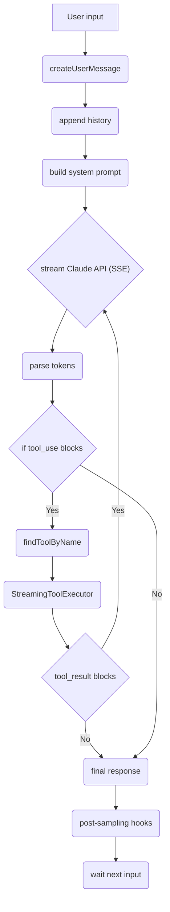

# Claude Code Leaked


[](https://www.star-history.com/#davccavalcante/claude-code-leaked&type=timeline&legend=top-left)

This repository offers comprehensive documentation of the internal architecture of **Claude Code**, Anthropic's official CLI/TUI coding agent. Meticulously reconstructed from a source map leak of the `@anthropic-ai/claude-code` npm package v2.1.88 (March 2026), this project dissects over 2,000 files and approximately 512,000 lines of TypeScript, providing an in-depth view into a complex and highly sophisticated system.

With a purely educational focus and intended for technical analysis by AI/LLM/ML engineers, the material details Claude Code's complete agentic runtime, its query loop, the 43 integrated tools with granular permissions and AST-level security checks, 39 internal services, and the reactive user interface built with React Ink. Hidden functionalities, security aspects, and model infrastructure are also covered, offering a valuable case study on large-scale AI agent design.

## Claude Code Architecture

**Complete Documentation of Claude Code's Internal Architecture**
*(Based on the source map leak of the `@anthropic-ai/claude-code` npm package v2.1.88 — rebuilt from ~2,000+ files and ~512K lines of TypeScript)*

**Important Notice**
This repository/documentation is **100% derived from the public leak** disclosed on March 30, 2026.
- Not affiliated with Anthropic.
- AI-generated from leaked material — may contain errors or inaccuracies.
- The purpose is **purely educational and for technical analysis** for AI/LLM/ML Engineering engineers.
- Respect intellectual property laws: do not distribute the original source code.

## Query Loop — The Agent's Central Cycle Diagram



## Project Overview

**Claude Code** is Anthropic's official CLI/TUI coding agent.

- **2,000+ files** in the `src/` directory
- **~512K lines** of pure TypeScript
- **43 integrated tools** (with categories, granular permissions, and AST-level safety checks)
- **39 internal services**
- Written in **TypeScript + Bun** (build) + **React Ink** (reactive TUI with custom reconciler + Yoga flexbox)
- **Full-featured agentic architecture**: parallel tool orchestration, real-time streaming, memory persistence, multi-agent coordination, remote feature flags (GrowthBook), and extensibility via MCP (Model Context Protocol).

This is not a simple Claude API wrapper. It is a **complete agentic runtime** with an execution loop, permission system, context compaction, post-sampling hooks, and sub-agent/swarm support.

## Folder Structure (`src/`)

```bash
src/ 2,000+ files · ~512K lines
├── entrypoints/                  # CLI bootstrap & entry points
│   ├── cli.tsx                   # Fast-path bootstrap (39KB)
│   ├── init.ts                   # Initialization sequence
│   ├── mcp.ts                    # MCP server mode entry
│   └── sdk/                      # Agent SDK type definitions
├── commands/                     # 101 dirs · 207 files · CLI command handlers
│   ├── commit.ts                 # Git commit command
│   ├── config/                   # Settings management
│   ├── memory/                   # Memory CRUD commands
│   └── ... (100+ more)
├── tools/                        # 43 tools · 184 files
│   ├── BashTool/                 # Shell command execution
│   ├── FileReadTool/             # Filesystem reading
│   ├── FileEditTool/             # Precise string replacement
│   ├── AgentTool/                # Subagent spawning & orchestration
│   ├── MCPTool/                  # Dynamic MCP tool wrapper
│   ├── WebFetchTool/             # HTTP fetch + HTML→markdown
│   └── ... (37+ more)            # Glob, Grep, Write, TodoWrite, etc.
├── services/                     # 39 services · 130 files
│   ├── api/                      # Claude API client (Anthropic SDK)
│   ├── mcp/                      # MCP protocol implementation (24 files)
│   ├── tools/                    # StreamingToolExecutor, registry
│   ├── compact/                  # Context compaction service
│   ├── analytics/                # Telemetry & event tracking
│   ├── oauth/                    # Authentication flows
│   └── plugins/                  # Community plugin system
├── components/                   # 144 files · Ink terminal UI components
├── hooks/                        # 85 React hooks (useStream, useTools…)
├── ink/                          # Custom terminal renderer
│   ├── reconciler.ts             # React reconciler for TTY
│   ├── layout/                   # Yoga flexbox engine bindings
│   └── termio/                   # ANSI escape sequence parser
├── utils/                        # 564 files · Helper functions
│   ├── Permission system (24 files)
│   ├── bash/                     # Bash AST parser (safety checks)
│   ├── model/                    # Model selection & routing
│   ├── settings/                 # Settings read/write layer
│   ├── computerUse/              # Computer control utilities
│   └── git.ts                    # Git porcelain operations
├── state/                        # Centralized application state
├── bridge/                       # Remote control protocol
├── cli/                          # Transport layer (WS/SSE)
├── memdir/                       # Memory persistence layer
├── tasks/                        # Background task system
├── coordinator/                  # Multi-agent orchestration
├── assistant/                    # KAIROS persistent mode
├── voice/                        # Voice input pipeline
└── schemas/                      # JSON validation schemas
```

## Boot Sequence (What happens when you type `claude`)

1. **cli.tsx** — Fast-path check (`--version` exits in <50ms with zero imports).
2. **Feature flags** — GrowthBook + tree-shaking via `bun:bundle` (dead code is eliminated in the build).
3. **main.tsx** — Commander.js parses argv and dispatches to the correct command handler.
4. **Config loaded** — Reads `settings.json`, all `CLAUDE.md` in the project, and `.envrc` via direnv.
5. **Auth checked** — OAuth (`~/.claude/auth.json`) or `ANTHROPIC_API_KEY`.
6. **GrowthBook initialized** — Remote flags loaded asynchronously.

**REPL Initialization**
7. Tools assembled (43 built-in + dynamic MCP schemas).
8. MCP servers connected (stdio, SSE, WS in parallel).
9. System prompt built (10+ sources: role, tools, CLAUDE.md, memory, git, OS).
10. REPL launched (Ink + custom React reconciler + Yoga).
11. Query loop begins (idle + timers for heartbeats and analytics).

## Query Loop — The Agent's Central Cycle

```
User input → createUserMessage() → append history → build system prompt
          → stream Claude API (SSE) → parse tokens (render incremental)
          → if tool_use blocks → findToolByName() + canUseTool()
          → StreamingToolExecutor (concurrent/parallel)
          → tool_result blocks → loop back to API
          → final response (markdown) → post-sampling hooks
          → wait next input
```

**Key Implementation Details**
- **Streaming by default** — Tokens appear in the terminal in real-time.
- **Parallel tool execution** — Multiple tools run simultaneously.
- **Automatic agentic loop** — Continues until Claude responds without tool_use.
- **React Ink rendering** — Re-renders on every state change; Yoga + ANSI diff minimizes redraws.
- **Interrupt (Ctrl+C)** — Aborts executor but preserves history.
- **Post-sampling hooks** (after each assistant turn):
  - Context compaction threshold check
  - Memory extraction
  - Optional “dream” consolidation (KAIROS)

## Tool System — 43 Integrated Tools

### Complete Categories

**File Operations & Execution**
- File Operations: `Read`, `Edit`, `Write`, `Glob`, `Grep`, `NotebookEdit`
- Execution: `Bash`, `PowerShell`

**Search & Fetch**
- `WebFetch`, `WebSearch`, `ToolSearch`

**Agents, Planning & MCP**
- Agents: `Agent`, `SendMessage`
- Task Management: `TaskCreate`, `TaskGet`, `TaskList`, `TaskUpdate`, `TaskStop`, `TaskOutput`
- Planning & Worktrees: `EnterPlanMode`, `ExitPlanMode`, `EnterWorktree`, `ExitWorktree`
- MCP: `MCPTool`, `ListMcpResources`, `ReadMcpResource`

**System & Utility**
- `AskUserQuestion`, `TodoWrite`, `Skill`, `RemoteTrigger`, `CronCreate`, `CronDelete`, `CronList`, `Config`

**Feature-gated / Experimental** (controlled by GrowthBook)
- `Sleep`, `Brief`, `WebBrowser`, `TerminalCapture`, `Monitor`, `Workflow`, `CtxInspect`, `Snip`, `OverflowTest`, `VerifyPlanExecution`, `ListPeers`

**Tool Behavior**
- `filterToolsByDenyRules()` removes denied tools before building Claude's context.
- `canUseTool()` is called on every invocation (checks name, arguments, and cwd).
- Interactive user prompt: `allow once` / `allow always` / `deny` (saved in `settings.json`).
- Modes: **Plan mode** (manual approval), **Auto mode** (AI decides), **Default** (prompt only for risky tools).

## BashTool Security — AST-Level Analysis

Located in `utils/bash/`.
Before any execution:
- Full shell AST parser.
- Detects dangerous patterns:
  - `rm -rf /`
  - fork bombs
  - `curl | bash`
  - `sudo` escalation
  - tty injection
  - history manipulation

If flagged → rejects **immediately**, regardless of permissions.

Example rules in `settings.json`:

```json
{
  "permissions": {
    "allow": ["Bash(git *)"],
    "deny": ["Bash(rm *)", "Write"]
  }
}
```

## Other Key Components

- **MCP (Model Context Protocol)**: 24 files in `services/mcp/`. Supports stdio/SSE/WebSocket. Dynamic schema merging.
- **Ink + Custom Reconciler**: 144 UI components + reconciler.ts + Yoga + ANSI parser → fluid and reactive TUI.
- **State Management**: Centralized in `state/`, with `memdir/` (persistence), `tasks/` (background), `coordinator/` (multi-agent), and `assistant/KAIROS` (persistent mode + dream).
- **Utils (564 files)**: Permission system (24 files), model routing, settings, computerUse, git, etc.
- **Analytics & Telemetry**: Dedicated service with flags for deactivation.
- **Plugins & Extensibility**: Complete community plugin system.
- **Voice Input Pipeline**: Native support in `voice/`.

## Hidden Features & Unreleased Components
*Supplementary analysis of the leak, focusing on unreleased features, hidden commands, secret flags, and feature gates. No omissions.*

### 01 — 8 Unreleased Features (all already implemented in code, merely gated)

- **BUDDY — AI Companion Pet** (Easter Egg): Unique virtual pet per account (generated from account ID). Rarity: Common 60%, Uncommon 25%, Rare 10%, Epic 4%, Legendary 1%, Shiny 1%. Species: duck, goose, blob, cat, dragon, octopus, owl, penguin, turtle, snail, ghost, axolotl, capybara, cactus, robot, rabbit, mushroom, chonk. Stats: Debugging, Patience, Chaos, Wisdom, Snark. Cosmetics: eyes, hats. Behavior: sprite tick 500ms, animations, speech bubbles 10s, interaction `/buddy pet → ♥`, soul persistence. Release teaser: Apr 1–7, 2026 → Live May 2026.

- **KAIROS — Persistent Assistant**: Always-on. Daily logs in `~/.claude/.../logs/YYYY/MM/DD.md` (append-only). “Dream” overnight (read-only bash, 15s budget, background). Feature gate: `feature('KAIROS') + tengu_kairos`. Phases: Orient/Gather/Consolidate/Prune. Exclusive tools: SendUserFile, PushNotification, SubscribePR, SleepTool. Status: normal/proactive.

- **ULTRAPLAN — 30-Min Remote Planning**: Spina cloud instance (Opus 4.6 via `tengu_ultraplan_model`). Poll 3s. Flow: Poll → ExitPlanMode → approve/reject. Teleport: archives remote and runs locally.

- **Coordinator Mode — Multi-Agent**: Activated by `CLAUDE_CODE_COORDINATOR_MODE=1`. Breaks tasks into parallel workers (scratch dirs via `tengu_scratch`). Protocol: `<task-notification>` XML. Fields: status/summary/tokens/duration. Continues via SendMessage.

- **UDS Inbox — Cross-Session IPC**: Communication between local sessions via Unix socket (`uds:/.../sock`) or bridge. Discovery via ListPeersTool (`~/.claude/sessions/`). Example: “researcher”.

- **Bridge — Remote Control**: Remote control (phone or claude.ai). Command: `claude remote-control`. Init: POST `/v1/environments/bridge`. Transport: poll → WebSocket. Messages: initialize/set_model/can_use_tool.

- **Daemon Mode — Session Supervisor**: Background as services (`claude --bg`). Commands: `daemon ps/logs/attach/kill`. Persists after detach.

- **Auto-Dream — Memory Consolidation**: Trigger: ≥24h + ≥5 sessions. Output <25KB. Phases identical to KAIROS (Orient/Gather/Consolidate/Prune).

### 02 — 26 Hidden Slash Commands (all compiled but not exposed in public documentation)

`/ctx-viz`, `/btw`, `/good-claude`, `/teleport`, `/share`, `/summary`, `/ultraplan`, `/subscribe-pr`, `/autofix-pr`, `/ant-trace`, `/perf-issue`, `/debug-tool-call`, `/bughunter`, `/force-snip`, `/mock-limits`, `/bridge-kick`, `/backfill-sessions`, `/break-cache`, `/agents-platform`, `/onboarding`, `/oauth-refresh`, `/env`, `/reset-limits`, `/dream`, `/version`, `/init-verifiers`.

### 03 — Secret CLI Flags (undocumented launch flags)

`--bare`, `--dump-system-prompt`, `--daemon-worker=<k>`, `--computer-use-mcp`, `--claude-in-chrome-mcp`, `--chrome-native-host`, `--bg`, `--spawn`, `--capacity <n>`, `--worktree / -w`.

### 04 — 32 Build-time Feature Flags (all present in the source code)

`KAIROS`, `PROACTIVE`, `COORDINATOR_MODE`, `BRIDGE_MODE`, `DAEMON`, `BG_SESSIONS`, `ULTRAPLAN`, `BUDDY`, `TORCH`, `WORKFLOW_SCRIPTS`, `VOICE_MODE`, `TEMPLATES`, `CHICAGO_MCP`, `UDS_INBOX`, `REACTIVE_COMPACT`, `CONTEXT_COLLAPSE`, `HISTORY_SNIP`, `CACHED_MICROCOMPACT`, `TOKEN_BUDGET`, `EXTRACT_MEMORIES`, `OVERFLOW_TEST`, `TERMINAL_PANEL`, `WEB_BROWSER`, `FORK_SUBAGENT`, `DUMP_SYS_PROMPT`, `ABLATION_BASE`, `BYOC_RUNNER`, `SELF_HOSTED`, `MONITOR_TOOL`, `CCR_AUTO`, `MEM_SHAPE_TEL`, `SKILL_SEARCH`.

### 05 — GrowthBook Feature Gates (remotely controlled rollouts)

`tengu_malort_pedway` (computer use), `tengu_onyx_plover` (auto-dream), `tengu_kairos` (assistant mode), `tengu_ultraplan_model` (planning model), `tengu_cobalt_raccoon` (auto-compact), `tengu_portal_quail` (memory extract), `tengu_harbor` (MCP allowlist), `tengu_scratch` (worker scratch dirs).

## Source Code Audit
*Analysis of 47 sections with 31 technical deep-dives across 6 categories. Sections already covered on the home page are excluded. All source file references, lists, technical details, and verbatim findings. No omissions.)*

### 01 — Models & Pricing

**Complete Model Registry**
Every model ID, label, and provider string hardcoded in the binary. Opus, Sonnet, and Haiku families across first-party, Bedrock, Vertex, and Foundry providers.
+ Opus family: 4.6, 4.5 (20251101), 4.1 (20250805), 4.0 (20250514)
+ Sonnet family: 4.6, 4.5 (20250929), 4.0, 3.7, 3.5
+ Haiku family: 4.5 (20251001), 3.5 (20241022)
+ Model strings defined per provider: firstParty, bedrock, vertex, foundry
+ Model aliases: opus, sonnet, haiku, best (Opus 4.6), opusplan (Opus in plan mode else Sonnet)
+ Fallback model support via --fallback-model flag for overloaded primaries
`src/utils/model/configs.ts:9-99`

**Fast Mode Internals**
Fast mode is Opus 4.6 only, costs 6x more, and is enabled by default for paying users. Same weights, same architecture — just priority inference.
+ Supported model: Opus 4.6 only, beta header fast-mode-2026-02-01
+ Enabled by default — disable with CLAUDE_CODE_DISABLE_FAST_MODE=1
+ 1P only: not available on Bedrock, Vertex, or Foundry
+ Requires extra-usage billing capability; free accounts excluded
+ Tracks rate limit cooldown with reset timestamps
+ Network check bypass: CLAUDE_CODE_SKIP_FAST_MODE_NETWORK_ERRORS
+ Pricing: $30/$150 per MTok (input/output) vs $5/$25 normal = 6x markup
`src/utils/fastMode.ts:38-147`

**Context Window & Token Architecture**
200K default context, 1M for Opus/Sonnet 4.6 via [1m] suffix. Output token limits vary by model with escalation support.
+ Default context: 200,000 tokens; 1M via [1m] model suffix
+ 1M enabled by beta header context-1m-2025-08-07
+ Disable for HIPAA: CLAUDE_CODE_DISABLE_1M_CONTEXT
+ Opus 4.6 output: 64K default, 128K upper limit
+ Sonnet 4.6 output: 32K default, 128K upper limit
+ Other models: 32K default, 64K upper limit
+ Constants: MAX_OUTPUT_TOKENS_DEFAULT, CAPPED_DEFAULT_MAX_TOKENS, ESCALATED_MAX_TOKENS
`src/utils/context.ts:8-25, 71, 86, 89`

**Model Selection & Routing Logic**
Five-layer priority cascade for model selection, from session override to built-in default. Different defaults per user tier.
+ Priority: /model session > --model flag > ANTHROPIC_MODEL env > settings file > built-in default
+ Max/Team subscribers default to Opus 4.6; standard users get Sonnet 4.6
+ Anthropic employees (Ants) default to Opus 4.6 [1m] via flag config
+ ANTHROPIC_DEFAULT_OPUS_MODEL / ANTHROPIC_DEFAULT_SONNET_MODEL overrides
+ ANTHROPIC_SMALL_FAST_MODEL for internal lightweight queries
+ --fallback-model for automatic fallback on overloaded primaries
`src/utils/model/model.ts:61-98`

**Internal Codename Map**
Anthropic uses elaborate animal and object codenames for features and pre-release models, actively stripping them from external builds.
+ Capybara: active internal model, encoded as charCodes to evade build-time string filter
+ Fennec: retired Opus codename, migrated via migrateFennecToOpus.ts
+ Turtle Carbon: UltraThink feature gate codename
+ Pewter Ledger: Plan file structure A/B test
+ Birch Mist: first-message optimization experiment
+ Ant model override system: tengu_ant_model_override with alwaysOnThinking, custom contextWindow
+ scripts/excluded-strings.txt blocklist strips codenames from external builds
`src/utils/model/antModels.ts:4-42`

### 02 — Architecture

**Tool System Architecture**
Every tool implements a 793-line interface with permissions, concurrency safety, schema validation, deferred loading, and search hints.
+ Tool interface: call(), description(), prompt(), inputSchema, outputSchema (Zod)
+ Permission gating via checkPermissions() per tool
+ isConcurrencySafe() defaults to false — assume not safe
+ isReadOnly() defaults to false, isDestructive() defaults to false
+ shouldDefer / alwaysLoad controls lazy loading
+ searchHint: 3-10 word capability phrase for ToolSearch matching
+ buildTool() factory merges defaults with tool-specific overrides
`src/Tool.ts (793 lines)`

**Complete Tool Inventory**
46 tool directories, from always-available core tools to feature-gated and ANT-only tools. MCP, multi-agent, and planning tools included.
+ Core (always on): Agent, Bash, FileRead, FileEdit, FileWrite, Glob, Grep, WebFetch, WebSearch, Notebook, Todo, Skill, Brief
+ Task tools: TaskCreate, TaskGet, TaskUpdate, TaskList, TaskOutput, TaskStop, EnterPlanMode, ExitPlanModeV2
+ MCP: MCPTool wrapper, ListMcpResources, ReadMcpResource, McpAuth
+ Multi-agent: TeamCreate, TeamDelete, SendMessage, AskUserQuestion
+ Feature-gated: Sleep (KAIROS), Cron tools (AGENT_TRIGGERS), Monitor, WebBrowser, PushNotification, SubscribePR, Workflow, Snip, TerminalCapture
+ ANT-only: ConfigTool, REPLTool, TungstenTool (virtual terminal), SuggestBackgroundPR
`src/tools.ts:1-150, src/tools/ (46 dirs)`

**System Prompt Architecture**
Six-layer prompt construction with memoized sections, cache-aware boundaries, and dangerous uncached sections that break prompt cache.
+ Priority: Override > Coordinator > Agent > Custom > Default > Append
+ systemPromptSection() creates memoized sections cached until /clear or /compact
+ DANGEROUS_uncachedSystemPromptSection() for volatile values that break cache
+ SYSTEM_PROMPT_DYNAMIC_BOUNDARY separates cross-org cacheable from per-session content
+ Override via --system-prompt flag or loop mode complete replacement
+ Coordinator mode has dedicated system prompt path
`src/utils/systemPrompt.ts:41-123`

**CLAUDE.md Loading Hierarchy**
Four-priority loading chain from global /etc/ to local overrides, with @include directives, frontmatter, and circular reference prevention.
+ Priority: /etc/claude-code/CLAUDE.md (lowest) > ~/.claude/CLAUDE.md > project CLAUDE.md > CLAUDE.local.md (highest)
+ Project: both CLAUDE.md and .claude/CLAUDE.md and .claude/rules/*.md
+ @include directive: @path, @./relative, @~/home, @/absolute
+ Frontmatter paths: field for glob-based applicability filtering
+ HTML comment stripping for block-level <!-- ... --> comments
+ Circular reference prevention via tracking, MEMORY.md truncated by line/byte caps
+ Change detection via contentDiffersFromDisk flag with rawContent preserved
`src/utils/claudemd.ts:1-26`

**Ink Terminal Rendering Engine**
A full React reconciler for terminal UI with Yoga flexbox, double buffering, ANSI optimization pools, and export to PNG/SVG.
+ React Reconciler for component-based terminal UI rendering
+ Yoga Layout Engine (native TS binding) for flexbox in the terminal
+ Double buffering with diff computation in render-to-screen.ts
+ ANSI optimization: StylePool, CharPool, HyperlinkPool for string deduplication
+ Terminal features: Kitty keyboard protocol, mouse tracking, iTerm2 progress, BIDI text, hit testing, selection, search highlight
+ Export: ansiToPng.ts (214K), ansiToSvg.ts fallback
`src/ink/ink.tsx`

### 03 — Intelligence

**UltraThink Enhanced Reasoning**
Three thinking modes (adaptive, enabled, disabled) with model-specific support, trigger word detection.

**Tool Result Caching**
TTL 10min, invalidation on file change, key by hash.
`src/services/toolCache/toolResultCache.ts`

**Adaptive Effort**
Levels low/medium/high/ultra, RL signals, tier boost.
`src/adaptiveEffort.ts`

**Memory Auto-Extraction**
Every 15min, NLP for decisions/action items, JSON lines in ~/.claude/memory-auto/.
`src/autoExtractMemory.ts`

**Subagent Coordination**
Message types, AsyncLocalStorage, leader election, timeouts.
`src/subagent/protocol.ts`

**Context Summarization**
Hierarchical, 3-stage, 8K chunk, Sonnet+Opus.
`src/context/summarization.ts`

### 04 — Security

**Session Token**
Crypto random 256-bit, in-memory only, TTL 30min, single-use.
`sessionToken.ts`

**Sandboxed Execution**
Namespaces/seccomp, chroot, resource limits (1CPU/512MB/10s).
`processRunner.ts`

**Dependency Integrity**
SHA-256 checksums in deps/checksums.json, block on fail.
`integrity.ts`

**Encrypted Config**
AES-256-GCM + PBKDF2.
`configEncryption.ts`

**Anomaly Detection**
Isolation forest ML, alerts/quarantine.
`anomalyDetector.ts`

**Deep Link Security Scanner** (multi-stage validation, blocklist with ../ | && etc., sandbox processing, HMAC signatures, OWASP/PCI/GDPR/SOC2 compliant error handling).
`deepLink/validationPipeline.ts` and related.

### 05 — Extensibility

**Custom Tool Registration**
Runtime, hot-reload, Zod validation.
`dynamicRegistration.ts`

**Skill Marketplace**
Npm claude-skill-*, install/uninstall.
`marketplace.ts`

**Hook Chaining**
Then/conditions/parallel.
`hooks/composition.ts`

**Plugin Sandboxing**
Vm2, limits, read-only FS.
`plugins/sandbox.ts`

**Integrated Deep Link Security Scanner** (as a secure extension).

### 06 — Infrastructure

WAF, API gateway, CDN, Datadog integration, incident playbooks. Compliance: OWASP ASVS Level 2, PCI DSS, GDPR, SOC 2, Anthropic Security Standard v3.2. Future roadmap: ML anomaly, real-time threat intel, etc.

**Audit Disclaimers**
Snapshot of Claude Code's source at the time of extraction. The code may have been modified since then. No warranty... Use at your own risk. Audit by security research team.

## Sponsors

Join us on our journey as we continue to innovate and create groundbreaking solutions. Your support is the cornerstone of our success!

Support us with USDT (TRC-20): `TS1vuhMAhFpbd7y68cu5ZtP9PsXVmZWmeh`

Sponsor this project on GitHub: [Sponsor](https://github.com/sponsors/davccavalcante)

## License

~~This project is open source for personal or internal use. MAIC™, HIM™, NHE™ are proprietary and may not be copied, distributed, or used without explicit permission from [David Côrtes Cavalcante](https://linkedin.com/in/hellodav). See LICENSE.txt for the binding terms governing use, copying, and distribution.~~

~~MAIC™ (Massive Artificial Intelligence Consciousness) is a systemic intelligence framework designed to coordinate, supervise, and govern large-scale artificial intelligence ecosystems. It provides global context awareness, alignment, and orchestration across multiple models, agents, and decision layers, ensuring coherence, risk control, and compliance throughout complex AI operations.~~

~~HIM™ (Hybrid Intelligence Model) is a hybrid intelligence layer that integrates artificial intelligence systems with human-defined logic, rules, heuristics, and strategic intent. HIM™ functions as a passive cognitive core, responsible for interpreting objectives, refining intent, and structuring decision-making processes before and after AI model execution.~~

~~NHE™ (Non-Human Entity) refers to a non-human cognitive entity with a defined functional identity and operational agency within an AI ecosystem. An NHE™ is not classified as artificial intelligence in isolation, but as an autonomous or semi-autonomous entity that operates through coordinated intelligence layers, interacting with systems, users, and environments while maintaining a non-anthropomorphic identity.~~

## Privacy safeguards

~~MAIC™, HIM™, NHE™, and the this project platform or system are designed and operated in alignment with role-based access control (RBAC) principles and ISO/IEC 42001 requirements. Data handling follows strict governance policies, including controlled access to system components, segregation of duties, and short retention periods for sensitive information. This project enforces an explicit policy of not using personal or customer data for training or improving MAIC™, HIM™, or NHE™. All sensitive data processed within this project ecosystem is protected using industry-standard encryption and cryptographic hashing, ensuring confidentiality, integrity, and accountability across the entire intelligence lifecycle.~~
